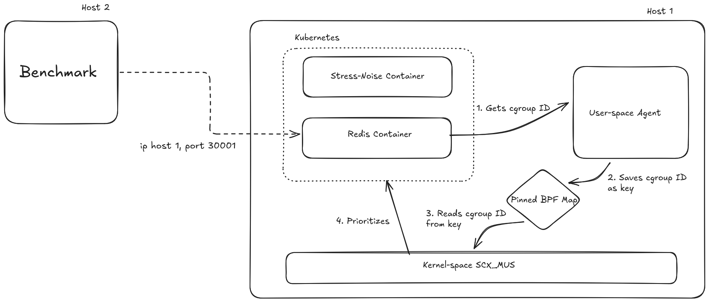

# SCX_MUS: Mostly Unfair Scheduler

SCX_MUS, or _Mostly Unfair Scheduler_, is a custom Linux scheduler built with the _sched_ext_ framework to optimize container priorization in Kubernetes for improved performance.

# Demo Video

placeholder

## 📖 Context and Objective

The idea for this project started casually at a bar table. Our group, patos, all computer science students, was gathered when a friend showed us the new Linux scheduling technology, *sched_ext* and how it was being used to improve performances of games, for example. We were fascinated, but it felt unrealistic for students to build a scheduler from scratch.

Months later, during a discussion about Kubernetes CPU management, specifically why `cpu.limits` is often discouraged and why `cpu.shares` is generally preferred, we began exploring how computational resources are allocated to containers. This led to a question: Is it possible to dynamically give more compute resources to a container, beyond the usual horizontal scaling or static allocation in manifests?

The idea was born: to attempt giving a container higher priority via a custom scheduler.

## 🧰 How It Works

The system consists of three main components:

-   The Scheduler (eBPF SCX): A sched_ext program loaded into the kernel. It implements a Weighted Virtual Time (vtime) algorithm with a Global Dispatch Queue. `main.bpf.c` defines a single shared dispatch queue. Every runnable task is inserted with it's `dsq_vtime`[1], and any CPU pulls from that queue. For simplicity, we decided on two weights which drive fairness: `HIGH_PRIORITY` (4096) for the selected container's cgroup ID, and `NORMAL_PRIORITY` (1024). In `kube_stopping`, we update `vruntime`[2] as `delta_exec * NORMAL_PRIORITY / task_weight`, so the prioritized cgroup's tasks acculumate time four times slower and therefore runs more often.

-   The Runner (C): A native loader responsible for loading the BPF object, pinning maps, and attaching the scheduler to the CPUs. `runner.c` handles the complete lifecycle of the scheduler program. it loads the compiled scheduler, pins the `high_prio_cgroups` BPF map at `sys/fs/bpf/high_prio_cgroups`, and attaches the `kube_ops` struct-ops to the kernel. This process must stay alive while our scheduler is running, when it exits it unpins the BPF map and the kernel falls back to CFS.

-   The Agent (Go): A Kubernetes-aware TUI (Terminal User Interface) that interacts with the K8s API and container runtime (Containerd/Docker) to identify target Cgroups and update the BPF priority map. `main.go` gives Kubernetes cluster operators an interactive interface to select which pod/container should be prioritized. It enumerates pods on the current node via the Kubernetes API, lets the user pick one with a Survey prompt, then uses Containerd to resolve the container's host PID. With `/proc/<pid>/cgroup` we find the unified cgroup path, `stat` it to derive the inode (the cgroup ID the BPF program expects), and write it into the pinned BPF map using the `cillium/ebpf` library. The agent currently writes a single entry into the map, matching our current idea of boosting one cgroup at a time.

-   Test Workload: The manifests can be used to deploy a Redis target and noisy neighbor workload that eats CPU. The Go agent flags the Redis pod's cgroup so the scheduler favors its CPU slices even while the stress pod churns.

-   Benchmarks: `benchmark.py` repeatedly runs `memtier_benchmark` against the Redis exposed NodePort (30001), capturing `ops/sec` and percentile latencies into CSVs, We run the scripts twice, once under vanilla CFS and once with SCX_MUS active, to quantify how much the prioritized Redis pod's latency improves while noise is present.

## 📂 Project Structure

This repository is organized as follows:

-   **scheduler/**: Source code for the eBPF scheduler (Kernel-space C) and the User-space Agent (Go).

    -   **bpf/**: The sched_ext logic written in C.

    -   **main.go**: The Kubernetes agent CLI.

-   **manifests/**: Kubernetes YAML manifests used to deploy the test environment (Redis and Stress-ng).

-   **evaluation/**: Comprehensive performance analysis and benchmarking tools.

    -   **datasets/**: Raw CSV data from benchmark runs.

    -   **benchmark/**: Python automation scripts for memtier_benchmark.

-   **writeups/**: Personal writeups on the inner workings of multiple parts of the system and the process of creating it

## 🎞️ Setup and Running

For complete instructions, check [our writeup](https://github.com/patos-ufscar/Hackathon-eBPF-2025/blob/main/writeups/setup_environment.md)

To run the benchmarks, check [the guide](https://github.com/patos-ufscar/Hackathon-eBPF-2025/blob/main/writeups/benchmark_guide.md)

## 📊 Analysis and Performance of SCX_MUS

If you wish to know the overall performance go to [evaluation/scheduler_analysis.ipynb](./evaluation/scheduler_analysis.ipynb).

## Challenges we Ran Into

One of the hardest parts was figuring out how to implement and run a scheduler using sched_ext_ops. There is very little documentation or guides online on how to load and execute your own custom scheduler, only examples of people running pre-made schedulers included with SCX.

Another challenge was our initial workflow: we wrote most of the code without compiling or testing it (a terrible practice, we know). Only after reaching a reasonable implementation did we start the work of compiling the kernel with sched_ext support, setting up Kubernetes clusters and designing the benchmark.

The debugging phase involved days of solving compilation mysteries, and unexpected behaviors before everything finally worked.

## 😁 Accomplishments That We Are Proud Of

The goal of our custom scheduler, wasn't to critique the Completely Fair Scheduler (CFS), our scheduler is, in fact, a highly simplified version of CFS. Instead, it was a two-fold endeavor:

1. To see if students could successfully implement a scheduler from scratch.

2. To explore different approaches to container scalability by dynamically adjusting a container's priority/resource share via a custom scheduler.

We consider the project a success in demonstrating both of these concepts.

## 🧠 What we learned

We learned about:

- The Linux scheduler architecture and its multiple scheduling classes

- Kernel internals and low-level scheduling paths

- Kubernetes resource management and API communication

- eBPF development and the sched_ext subsystem

- Performance evaluation, benchmarking, and debugging complex systems

## 🚀 What's next for SCX_MUS

- Building a more sophisticated control mechanism that uses the Kubernetes API to gather metrics and automatically adjust the container's priority share based on workload (e.g. implementing a hook that prioritize a container when its netns be with a X quantity of packets)

- Refining SCX_MUS by:
    - Adding multi DSQs for multi-cores enviroments
    - Developing more sophisticated migration heuristics and improving L2/L3 cache locality

---

## 🦆🦆 Who We Are 🦆🦆

[PATOS](https://patos.dev/) is an open source group that focuses on giving talks and contributing to the open source community.

## 🧑‍💻 Team Members

Our team for this Hackathon consisted of 3 members of PATOS.

-   [Luiz Otávio](https://linkedin.com/in/luiz-mello-1117b4280)
-   [Lucas Cardoso](https://linkedin.com/in/lucasac004)
-   [Oliver Miyar Ugarte](https://linkedin.com/in/oliver-miyar-ugarte-053580367)
-   [Rodrigo Coffani](https://www.linkedin.com/in/rcoff)

We had no practical experience working with eBPF or sched_ext, so this Hackathon was a great learning opportunity!

## Contribution

We welcome contributions from the community! If you'd like to contribute, feel free to submit a pull request.
