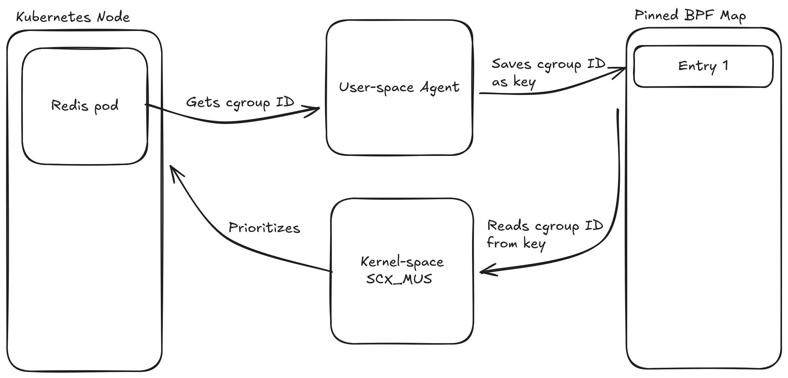

# SCX_MUS: Mostly Unfair Scheduler

SCX_MUS, or _Mostly Unfair Scheduler_, is a custom Linux scheduler built with the _sched_ext_ framework to optimize container priorization in Kubernetes for improved performance.

# Demo Video

placeholder

## 📖 Context and Objective

The idea for this project came while we were studying how cgroups enforce CPU quotas and the functioning of Linux schedulers. Existing schedulers treat all containers equally even when latency-sensitive tasks need some extra headroom. Since cgroups have stable IDs, we thought we could make a scheduler that will prioritize a chosen container using it's cgroup ID. By feeding a chosen container's cgroup ID into our sched_ext scheduler via a BPF map, we can nudge the kernel to prioritize critical pods.

So we defined our main objectives:

-   Build the sched_ext scheduler. Initially, as a proof of concept, we will receive one cgroup ID from the user-space agent and use it to prioritize the chosen container.
-   Simultaneously, build the user-space agent to easily allow the user to choose which container they wish to prioritize.
-   Figure out how to set up a reproducible environment for us to test this project during it's development
-   Create a solid methodology to measure latency and performance before and after using our scheduler

## 🧰 How It Works

The system consists of three main components:

-   The Scheduler (eBPF SCX): A sched_ext program loaded into the kernel. It implements a Weighted Virtual Time (vtime) algorithm with a Global Dispatch Queue. `main.bpf.c` defines a single shared dispatch queue. Every runnable task is inserted with it's `dsq_vtime`[1], and any CPU pulls from that queue. For simplicity, we decided on two weights which drive fairness: `HIGH_PRIORITY` (4096) for the selected container's cgroup ID, and `NORMAL_PRIORITY` (1024). In `kube_stopping`, we update `vruntime`[2] as `delta_exec * NORMAL_PRIORITY / task_weight`, so the prioritized cgroup's tasks acculumate time four times slower and therefore runs more often.

-   The Runner (C): A native loader responsible for loading the BPF object, pinning maps, and attaching the scheduler to the CPUs. `runner.c` handles the complete lifecycle of the scheduler program. it loads the compiled scheduler, pins the `high_prio_cgroups` BPF map at `sys/fs/bpf/high_prio_cgroups`, and attaches the `kube_ops` struct-ops to the kernel. This process must stay alive while our scheduler is running, when it exits it unpins the BPF map and the kernel falls back to CFS.

-   The Agent (Go): A Kubernetes-aware TUI (Terminal User Interface) that interacts with the K8s API and container runtime (Containerd/Docker) to identify target Cgroups and update the BPF priority map. `main.go` gives Kubernetes cluster operators an interactive interface to select which pod/container should be prioritized. It enumerates pods on the current node via the Kubernetes API, lets the user pick one with a Survey prompt, then uses Containerd to resolve the container's host PID. With `/proc/<pid>/cgroup` we find the unified cgroup path, `stat` it to derive the inode (the cgroup ID the BPF program expects), and write it into the pinned BPF map using the `cillium/ebpf` library. The agent currently writes a single entry into the map, matching our current idea of boosting one cgroup at a time.

-   Test Workload: The manifests can be used to deploy a Redis target and noisy neighbor workload that eats CPU. The Go agent flags the Redis pod's cgroup so the scheduler favors its CPU slices even while the stress pod churns.

-   Benchmarks: `benchmark.py` repeatedly runs `memtier_benchmark` against the Redis exposed NodePort (30001), capturing `ops/sec` and percentile latencies into CSVs, We run the scripts twice, once under vanilla CFS and once with SCX_MUS active, to quantify how much the prioritized Redis pod's latency improves while noise is present.

## 📂 Project Structure

This repository is organized as follows:

-   **scheduler/**: Source code for the eBPF scheduler (Kernel-space C) and the User-space Agent (Go).

    -   **bpf/**: The sched_ext logic written in C.

    -   **main.go**: The Kubernetes agent CLI.

-   **manifests/**: Kubernetes YAML manifests used to deploy the test environment (Redis and Stress-ng).

-   **evaluation/**: Comprehensive performance analysis and benchmarking tools.

    -   **datasets/**: Raw CSV data from benchmark runs.

    -   **benchmark/**: Python automation scripts for memtier_benchmark.

-   **writeups/**: Personal writeups on the inner workings of multiple parts of the system and the process of creating it

## 🎞️ Setup and Running

For complete instructions, check [our writeup](https://github.com/patos-ufscar/Hackathon-eBPF-2025/blob/main/writeups/setup_environment.md)

---

## Who We Are

[PATOS](https://patos.dev/) is an open source group based in Brazil @ UFSCar (Universidade Federal de São Carlos) that focuses on giving talks and contributing to the open source community.

## Team Members

Our team for this Hackathon consisted of 3 members of PATOS.

-   [Luiz Otávio](https://linkedin.com/in/luiz-mello-1117b4280)
-   [Lucas Cardoso](https://linkedin.com/in/lucasac004)
-   [Oliver Miyar Ugarte](https://linkedin.com/in/oliver-miyar-ugarte-053580367)

We had no practical experience working with eBPF or sched_ext, so this Hackathon was a great learning opportunity!

## Contribution

We welcome contributions from the community! If you'd like to contribute, feel free to submit a pull request.
