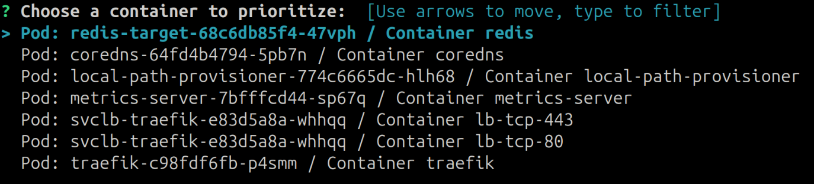
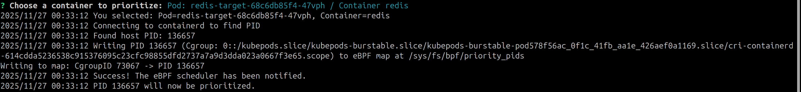

# The Userspace Code

For the userspace part of our scheduler, we wanted a simple CLI interface that would allow the user to select which container should be prioritized. We chose to implement this using Go mostly because of our own interest in learning a bit more about the language, but also because it was the language of choice of the ['eBPF Begginer Skill Path'](https://labs.iximiuz.com/skill-paths/ebpf-beginner-skill-path-aa16c6e8) reccomended by [ebpf.io](https://ebpf.io/labs/).

The implementation itself is quite straight-forward, as there are very consolidated Go libraries that allow for interacting with Kubernetes clusters and containers, to easily create an interactive CLI interface, and to manage BPF maps.

For those purposes, we utilized the [client-go](https://github.com/kubernetes/client-go), [containerd](https://github.com/containerd/containerd), [survey](github.com/AlecAivazis/survey/v2) and [ebpf-go](https://github.com/cilium/ebpf) libraries.

The program will interact with the Kubernetes client inside the current node to retrieve a list of all currently running containers. Then it will prompt the user to select which container they want to prioritize using the scheduler. After the user selects one, it will retrieve the cgroup ID tied to the container and save it to the BPF map.

